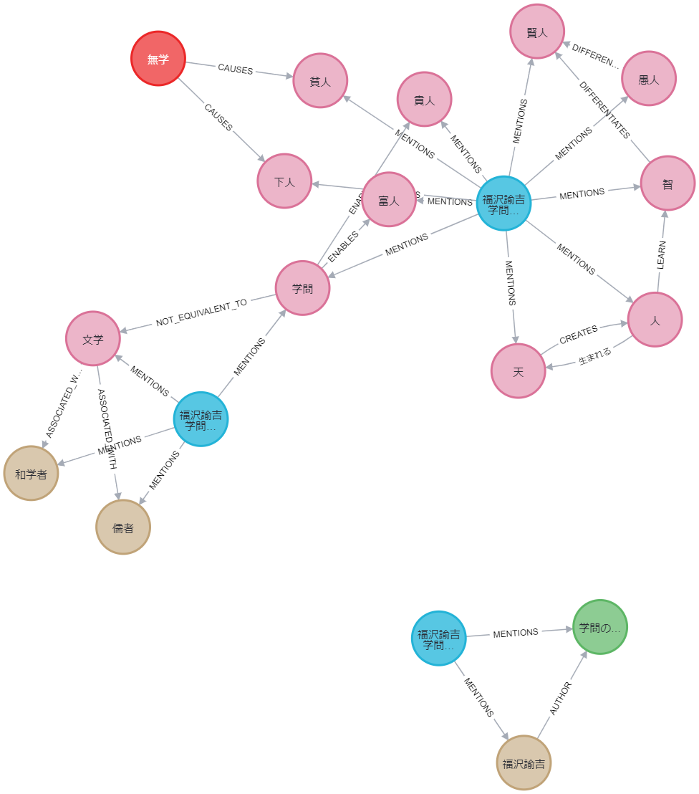

# References

## Azure Functions

Run the function app locally

```shell
# Run the function app locally with the Azure Functions Core Tools
$ poetry run func start
```

Deploy the function app to Azure

```shell
# Deploy resources to Azure
$ bash scripts/deploy_azure_functions_resources.sh

# Export dependencies to requirements.txt
$ poetry export -f requirements.txt -o requirements.txt --without-hashes

# Deploy the function app
$ func azure functionapp publish $FUNCTION_APP_NAME
```

### References

- [Using FastAPI Framework with Azure Functions](https://learn.microsoft.com/en-us/samples/azure-samples/fastapi-on-azure-functions/fastapi-on-azure-functions/)

## Streamlit

```shell
$ poetry run python -m streamlit run sandbox_python/streamlits/main.py
```

## LangChain

To return structured data from a model, follow the instructions below:

- [MS Learn > Structured outputs](https://learn.microsoft.com/en-us/azure/ai-services/openai/how-to/structured-outputs?tabs=python)
- [How to return structured data from a model](https://python.langchain.com/docs/how_to/structured_output/)

To support multimodal inputs, follow the instructions below:

- [How to pass multimodal data directly to models](https://python.langchain.com/docs/how_to/multimodal_inputs/)
- [How to use multimodal prompts](https://python.langchain.com/docs/how_to/multimodal_prompts/)

## Graph RAG

To create a knowledge graph database, follow the instructions below:

```shell
# Start the Neo4j database
$ docker compose up

# Create indexes and constraints
$ poetry run python scripts/llms_cli.py create-knowledge-graph --verbose
```

After creating the knowledge graph, access the Neo4j browser at `http://localhost:7474` and you can query it using the following command:

```
// Get some data
MATCH (n1)-[r]->(n2) RETURN r, n1, n2 LIMIT 25
```



### References

- [LangChain > Neo4j](https://python.langchain.com/docs/integrations/providers/neo4j/)
- [Enhancing RAG-based application accuracy by constructing and leveraging knowledge graphs](https://blog.langchain.dev/enhancing-rag-based-applications-accuracy-by-constructing-and-leveraging-knowledge-graphs/)
- [llm/enhancing_rag_with_graph.ipynb](https://github.com/tomasonjo/blogs/blob/master/llm/enhancing_rag_with_graph.ipynb?ref=blog.langchain.dev)
- [LangChain Neo4j Integration](https://neo4j.com/labs/genai-ecosystem/langchain/)

## ONNX runtime

```shell
# Download the model
$ poetry run huggingface-cli download microsoft/Phi-3-mini-4k-instruct-onnx \
    --include "cpu_and_mobile/cpu-int4-rtn-block-32-acc-level-4/*" \
    --local-dir .onnx/

# Run the model
$ poetry run python scripts/slms_cli.py run-slm --verbose
```

### References

- [microsoft/onnxruntime-genai](https://github.com/microsoft/onnxruntime-genai)

## Profiler

### [line_profiler](https://github.com/pyutils/line_profiler): Line-by-line profiling for Python

```shell
$ LINE_PROFILE=1 poetry run python -m memory_profiler scripts/llms_cli.py create-mermaid-png-memory
USER_AGENT environment variable not set, consider setting it to identify your requests.
Filename: scripts/llms_cli.py

Line #    Mem usage    Increment  Occurrences   Line Contents
=============================================================
   216    140.1 MiB    140.1 MiB           1   @app.command()
   217                                         @memory_profile
   218                                         def create_mermaid_png_memory(
   219                                             output_mermaid_png: str = typer.Option("graph.png", help="Path to output mermaid png."),
   220                                             verbose: bool = typer.Option(False, help="Verbose mode."),
   221                                         ):
   222    140.1 MiB      0.0 MiB           1       if verbose:
   223                                                 import logging
   224
   225                                                 logging.basicConfig(level=logging.DEBUG)
   226
   227    140.4 MiB      0.3 MiB           1       get_graph().get_graph().draw_mermaid_png(output_file_path=output_mermaid_png)


Timer unit: 1e-09 s

Wrote profile results to profile_output.txt
Wrote profile results to profile_output_2024-10-21T102700.txt
Wrote profile results to profile_output.lprof
To view details run:
python -m line_profiler -rtmz profile_output.lprof

$ poetry run python -m line_profiler -rtmz profile_output.lprof
```

### [memory_profiler](https://github.com/pythonprofilers/memory_profiler): Monitor Memory usage of Python code

```shell
$ poetry run python -m memory_profiler scripts/llms_cli.py create-mermaid-png-memory
USER_AGENT environment variable not set, consider setting it to identify your requests.
Filename: scripts/llms_cli.py

Line #    Mem usage    Increment  Occurrences   Line Contents
=============================================================
   216    140.0 MiB    140.0 MiB           1   @app.command()
   217                                         @memory_profile
   218                                         def create_mermaid_png_memory(
   219                                             output_mermaid_png: str = typer.Option("graph.png", help="Path to output mermaid png."),
   220                                             verbose: bool = typer.Option(False, help="Verbose mode."),
   221                                         ):
   222    140.0 MiB      0.0 MiB           1       if verbose:
   223                                                 import logging
   224
   225                                                 logging.basicConfig(level=logging.DEBUG)
   226
   227    140.3 MiB      0.3 MiB           1       get_graph().get_graph().draw_mermaid_png(output_file_path=output_mermaid_png)
```
